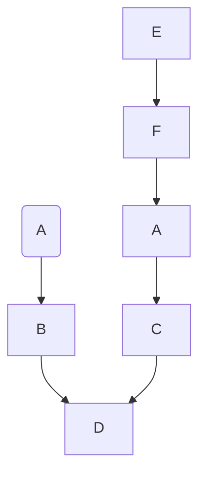
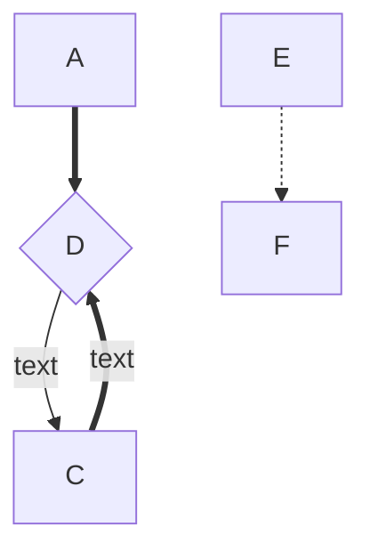

<!--* [1.标题](#1) 可以生成目录-->
# markdown 学习笔记

<h1 id="1">1.markdown语法示例</h1>
## 1. 标题

<!-- 一级标题 -->
# TEST
<!-- 二级级标题 -->
## TEST
<!-- 三级标题 -->
### TEST
<!-- 四级标题 -->
#### TEST
<!-- 五级标题 -->
#####  TEST
<!-- 六级标题 -->
###### TEST
####### TEST
<!-- 最多支持六级标题 -->

## 2. 横线

<!-- *** -->
***
<!-- --- -->

---
<!-- ___ -->
___

## 3. 文本
<!-- 普通文本 -->

这是markdown 测试文本

<!-- 单行文本 已一个tab间距或者四个空格开头 -->

  这个是单行文本

<!-- 加粗字体 -->
**加粗字体**

<!-- 斜体加粗 -->
***斜体加粗***

<!-- 倾斜 -->
*倾斜文字*

<!-- 删除线 -->
~~删除线~~
## 4. 引用

<!-- 在文字前面加上  > -->
>引用文字
>>引用文字
>>>引用文字
>>>>引用文字
>>>>>引用文字
>>>>>>引用文字
>>>>>>>引用文字
>>>>>>>>引用文字
>>>>>>>>>>>>>>>>>>>>>>>>>>>>>>>>>>引用文字

## 5. 图片
<!--  -->


## 6. 超链接
<!-- [超链接名](超链接地址 "超链接title") -->
[我的github](https://github.com/hbbaly '我的github')

## 7. 锚点
<!-- [回到顶部](#readme) -->
[回到顶部](#1)

## 8 . 无序列表
<!-- -+* 都可以 -->
- 无序列表
+ 无序列表
* 无序列表

## 9. 有序列表
<!-- 数字加点 序号跟内容之间要有空格 -->
1.列表内容

2.列表内容

3.列表内容

## 10.列表嵌套

<!-- 列表嵌套上一级和下一级之间敲三个空格即可 -->

1.列表内容


- 这是嵌套列表

+ 这是嵌套列表

## 11. 表格
<!--
  表头|表头|表头
---|:--:|---:
内容|内容|内容
内容|内容|内容


第二行分割表头和内容。
- 有一个就行，为了对齐，多加了几个
文字默认居左
-两边加：表示文字居中
-右边加：表示文字居右
-->
|姓名|性别|年龄|
|---|:--:|---:|
|否过|请问|WDEF|
|AFSDF |内WDDEFD容|SDSF内容|


## 12. 代码
<!-- 单行代码 -->
`<h1>标题</h1>`

<!-- 多行代码 三个反引号-->
```
  <div>
    <p>多行代码</p>
  </div>
```


## 13. 流程图



    graph 方向描述

    图表中的其他语句...
#### 图表方向
|用词|含义|
|---|:--:|
|TB|从上到下|
|BT|从下到上|
|RL|从右到左|
|LR|从左到右|

#### 节点定义

|表述|说明|
|---|:--:|
|id[文字]|矩形节点|
|id(文字)|圆角矩形节点|
|id((文字))|圆形节点|
|id>文字]|右向旗帜状节点|
|id{文字}|菱形节点|

#### 节点间的连线
|表述|说明|
|---|:--:|
|>|添加尾部箭头|
|-|不添加尾部箭头|
|--|单线|
|--text--|单线上加文字|
|==|粗线|
|==text==|粗线加文字|
|-.-|虚线|
|-.text.-|虚线加文字|



